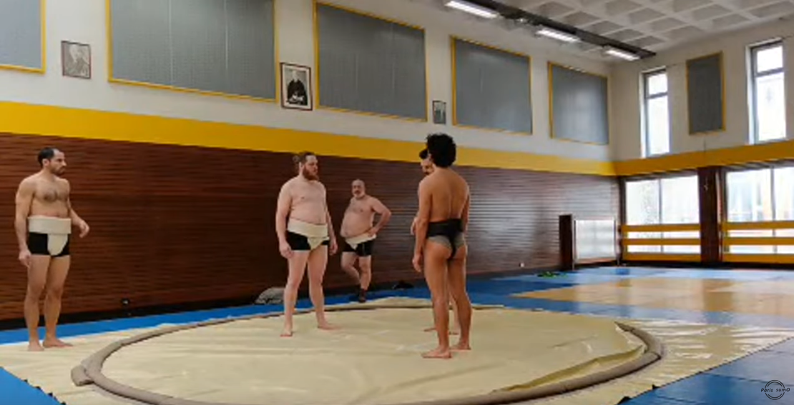

L'entrainement du 9 février 2025 a été diffusé en direct
sur la chaîne Youtube du club [Paris Sumo](https://www.youtube.com/@sumoparis1),
je vous propose une table des matières sommaires des différentes séquences
de [l'entrainement du jour](https://www.youtube.com/watch?v=qZj-QMpFfKM):

- Étirements: https://youtu.be/qZj-QMpFfKM?t=24
- Suriashi / Installation du Dohyo / Shiko: https://youtu.be/qZj-QMpFfKM?t=1308
- Exercices de renforcement musculaires : https://youtu.be/qZj-QMpFfKM?t=1879
- Travail de la "technique" Utchari : https://youtu.be/qZj-QMpFfKM?t=3167
- [Début des combats]:
    - 1 match à la fois: https://youtu.be/qZj-QMpFfKM?t=3747
    - Premier à 2 victoires: https://youtu.be/qZj-QMpFfKM?t=4350
    - Vainqueur reste (max 3 fois): https://youtu.be/qZj-QMpFfKM?t=5832
    - Roi de la colline : https://youtu.be/qZj-QMpFfKM?t=7404