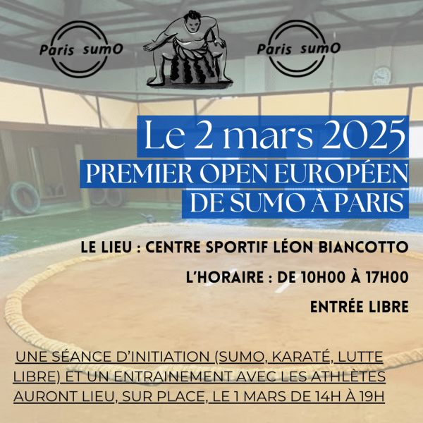

L'intégralité de l'Open de Sumo parisien est disponible en replay sur [Youtube](https://www.youtube.com/watch?v=tsePaoEOLEc).
Je vous liste ici les principaux repères temporels pour vous permettre de naviguer plus rapidement vers ce qui pourrait vous intéresser / vous éviter les temps morts.

La liste des repères temporels par catégorie est disponible sur Youtube, en bonus voici les repères pour mes combats:

## Catégorie (-100kg)
- https://youtu.be/tsePaoEOLEc?t=5639
- https://youtu.be/tsePaoEOLEc?t=5813
- https://youtu.be/tsePaoEOLEc?t=6129
- https://youtu.be/tsePaoEOLEc?t=6294
- https://youtu.be/tsePaoEOLEc?t=6453
- https://youtu.be/tsePaoEOLEc?t=6716
- https://youtu.be/tsePaoEOLEc?t=6928
- https://youtu.be/tsePaoEOLEc?t=7129

## Open weight
- https://youtu.be/tsePaoEOLEc?t=16624

## En équipe (les Poneys fringants*)
- https://youtu.be/tsePaoEOLEc?t=18589
- https://youtu.be/tsePaoEOLEc?t=19023
- https://youtu.be/tsePaoEOLEc?t=19760

* oui, je ne tiens rien pour sacré, et il serait dommage de rater l'occasion de placer une petite référence au Seigneur des Anneaux.

## Réactions à froid
Il s'agissait certes du premier open européen à Paris, mais c'était aussi ma première compétition de Sumo.
Cet Open était l'occasion pour moi de découvrir le déroulement d'une compétition dans un cadre propice a la découverte avec des nations "mineures" (le niveau à l'Est étant réputé plus relevé).

J'y allais sans ambition (espérant tout de même remporter au moins un de mes affrontements) et avec l'envie de participer a minima dans ma catégorie et en Open Weight.

Je suis ravi de mes résultats dans ma catégorie de poids, remportant 4 de mes combats et finissant même 2è ex-aequo au terme des combats réguliers. Le Sumo ne reconnaissant pas l'égalité,
des play-off eurent lieux et je perdais mes 2 combats finissant à la 4è place sur 7 lutteurs, satisfait de ma matinée.

Mon unique combat en open weight fut rapidement expédié qui m'aura dominé de son poids et de sa technique dans un combat à sens unique.
À noter un tachi-ai qui m'aura laissé l'épaule endolorie pendant plusieurs jours !

Des camarades étant en recherche d'un 3è larrons je me décidais à les épauler malgré une fatigue déjà bien présente. La performance de mes 2 camarades,
ainsi que ma victoire dans mon dernier duel face à un lutteur adepte de la baffe que je connais bien suffiront à nous faire décrocher une 3è place (sur 5 équipes), une bonne surprise pour cloturer cet open !

Au final ce seront pas moins de 12 duels qui m'auront laissé sur les rotules après une journée de duels entrecoupés de longues pauses. Je suis content de ma performance,
et ravi d'avoir pu rencontrer des lutteurs et lutteuses venus d'autres pays (Royaume-Unis, Norvège, Portugal, Suisse) ainsi que d'autres coin de l'Hexagone pour une journée qui s'est déroulée dans la bonne humeur.

